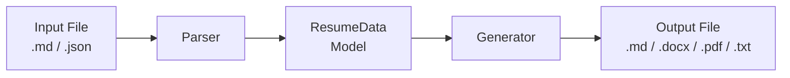
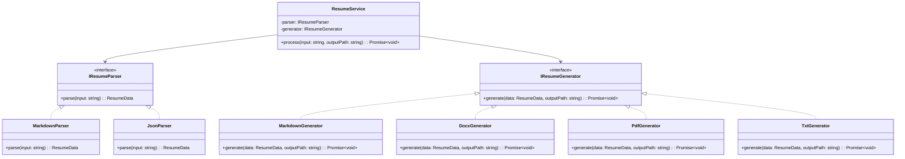
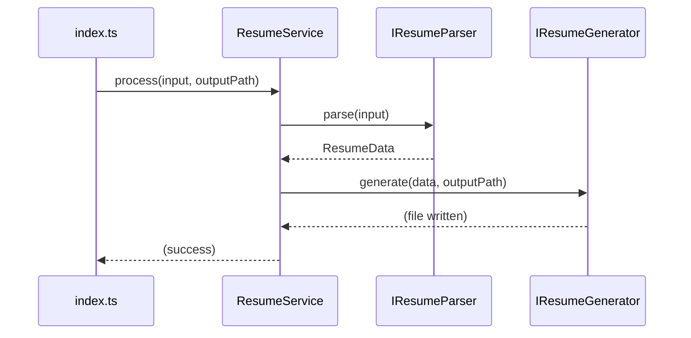
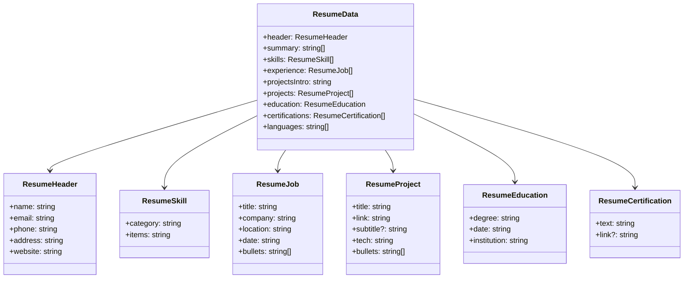

# ATS Resume Generator

A command-line tool that parses resume data from **Markdown** or **JSON** and generates formatted output in **Markdown**, **DOCX**, **PDF**, or **plain text** (TXT). Ships as a TypeScript source project and as pre-built standalone binaries — no Node.js required for end users.

---

## Quick Start (Pre-built Binaries)

No Node.js or development tools required. Download a standalone binary for your OS — it's a single file, ready to run.

| Platform                        | Binary                                 |
| ------------------------------- | -------------------------------------- |
| **Windows** (x64)               | `ats-resume-generator-windows-x64.exe` |
| **Linux** (x64)                 | `ats-resume-generator-linux-x64`       |
| **Linux** (ARM64)               | `ats-resume-generator-linux-arm64`     |
| **macOS** (Apple Silicon / M1+) | `ats-resume-generator-darwin-arm64`    |
| **macOS** (Intel)               | `ats-resume-generator-darwin-x64`      |

PDF generation requires the `docx-to-pdf.wasm` file to be placed next to the executable. This file is bundled automatically when building with `yarn package`.

### First-time Setup

```bash
# Windows (Command Prompt)
ats-resume-generator-windows-x64.exe resume.md resume.docx

# Linux / macOS (make executable first)
chmod +x ats-resume-generator-linux-x64
./ats-resume-generator-linux-x64 resume.md resume.docx
```

---

## Overview

This project implements a **SOLID‑principled** workflow for resume generation. It separates parsing, data modeling, and output generation, allowing new input or output formats to be added without modifying existing code.

### Key Features

- **Input Formats:** Markdown (`.md`) or JSON (`.json`)
- **Output Formats:** Markdown (`.md`), DOCX (`.docx`), PDF (`.pdf`), plain text (`.txt`)
- **TypeScript** with strict typing
- **PDF generation** via `docx‑to‑pdf‑wasm` (converts DOCX to PDF using WebAssembly)
- **Dependency injection** for decoupled, testable components
- **Standalone binaries** for Windows, macOS, and Linux (via Bun `--compile`)

### High‑Level Data Flow (Workflow)



This diagram shows the entire transformation workflow from input to output.

---

## Architecture

```
src/
├── core/               # Interfaces & data models
│   ├── interfaces.ts   # IResumeParser, IResumeGenerator
│   └── models.ts       # ResumeData, ResumeJob, ResumeProject, etc.
├── parsers/            # Input parsers
│   ├── MarkdownParser.ts
│   └── JsonParser.ts
├── generators/         # Output generators
│   ├── MarkdownGenerator.ts
│   ├── DocxGenerator.ts
│   ├── PdfGenerator.ts
│   └── TxtGenerator.ts
├── services/           # Orchestration
│   └── ResumeService.ts
└── index.ts            # CLI entry point
```

### SOLID Principles Applied

| Principle                 | Implementation                                                                                          |
| ------------------------- | ------------------------------------------------------------------------------------------------------- |
| **Single Responsibility** | Each parser/generator handles exactly one format                                                        |
| **Open/Closed**           | New parser/generator classes can be added without changing existing ones (CLI entry point needs update) |
| **Liskov Substitution**   | All parsers/generators are interchangeable                                                              |
| **Interface Segregation** | `IResumeParser` and `IResumeGenerator` are minimal and focused                                          |
| **Dependency Inversion**  | `ResumeService` depends on abstractions, not concretions                                                |

#### Class Diagram – SOLID Design



This class diagram clarifies the interface‑based design and dependency injection.

---

## Prerequisites (Building from Source)

- Node.js version 18+ (ES2020 modules)
- Yarn 4.17.0 (recommended — project ships with a `yarn.lock`)
- [Bun](https://bun.sh) — only required for building standalone binaries

## Installation (Building from Source)

```bash
yarn install
```

### Available Scripts

| Command                        | Description                                                              |
| ------------------------------ | ------------------------------------------------------------------------ |
| `yarn build` / `npm run build` | Compile TypeScript source to `./dist/`                                   |
| `yarn start`                   | Run `node dist/index.js` (requires build)                                |
| `yarn generate`                | Run `ts-node src/index.ts` directly (no build needed)                    |
| `yarn package`                 | Build standalone binaries for all platforms (output: `./build/Release/`) |
| `yarn package:windows`         | Build a standalone binary for Windows x64 (output: `./build/Release/`)   |

### Run (from source)

```bash
yarn generate <input.(md|json)> <output.(md|docx|pdf|txt)>
```

### Run (compiled)

```bash
yarn start <input.(md|json)> <output.(md|docx|pdf|txt)>
```

---

## Usage Example

```bash
yarn generate resume.md resume.docx
```

This reads `resume.md`, parses it into a `ResumeData` object, and writes a formatted DOCX file.

```bash
yarn generate resume.json resume.pdf
```

Reads JSON input, generates a temporary DOCX, converts it to PDF, and cleans up the temporary file.

---

## Sequence Diagram – Execution Flow



This shows the runtime interaction between the main entry point, the service, and the pluggable components.

---

## Input Format

### Data Model – ResumeData Structure



This diagram gives a quick visual reference of the data structure used throughout the system.

### Markdown Structure

The Markdown parser expects sections with the following headings (case‑sensitive):

```
# John Doe
E-mail: john@example.com
Phone: +1 234 567 890
Address: 123 Main St, City, Country
Website: https://john.dev

## PROFESSIONAL SUMMARY
[paragraph text]

## TECHNICAL SKILLS
- Category: item1, item2, item3

## PROFESSIONAL EXPERIENCE
Senior Developer - Company Inc., Location
01/2020 – Present
- Bullet point 1
- Bullet point 2

## PROJECTS
[Complete portfolio](https://github.com/john/portfolio)

[Project Title](https://project.link)
Technologies: TypeScript, Node.js
- Bullet point

## EDUCATION
B.Sc. in Computer Science
09/2016 – 06/2020
- University Name

## CERTIFICATIONS
- Certification Name - [Reference](https://cert.link)

## LANGUAGES
- English (Native)
- Spanish (Fluent)
```

### JSON Structure

The JSON schema mirrors the `ResumeData` interface:

```json
{
  "header": {
    "name": "John Doe",
    "email": "john@example.com",
    "phone": "+1 234 567 890",
    "address": "123 Main St, City, Country",
    "website": "https://john.dev"
  },
  "summary": ["Paragraph text"],
  "skills": [{ "category": "Programming", "items": "TypeScript, Node.js, Python" }],
  "experience": [
    {
      "title": "Senior Developer",
      "company": "Company Inc.",
      "location": "Remote",
      "date": "01/2020 – Present",
      "bullets": ["Bullet point 1", "Bullet point 2"]
    }
  ],
  "projectsIntro": "[Complete portfolio](https://github.com/john/portfolio)",
  "projects": [
    {
      "title": "Project Title",
      "link": "https://project.link",
      "subtitle": "Optional subtitle",
      "tech": "TypeScript, Node.js",
      "bullets": ["Bullet point"]
    }
  ],
  "education": {
    "degree": "B.Sc. in Computer Science",
    "date": "09/2016 – 06/2020",
    "institution": "University Name"
  },
  "certifications": [{ "text": "Certification Name", "link": "https://cert.link" }],
  "languages": ["English (Native)", "Spanish (Fluent)"]
}
```

---

## Output Format Details

| Format       | Implementation Notes                                                                                       |
| ------------ | ---------------------------------------------------------------------------------------------------------- |
| **Markdown** | Plain text with standard Markdown syntax                                                                   |
| **DOCX**     | Uses `docx` library with custom styles (Calibri, green accents, shaded headings)                           |
| **PDF**      | Generated via DOCX → PDF conversion using `docx‑to‑pdf‑wasm`; creates and removes a temporary `.docx` file |
| **TXT**      | Strips all Markdown formatting, converts links to `text (url)`, and uses plain ASCII separators            |

---

## Technical Constraints

- **PDF Generation:** Requires a WebAssembly module from `docx‑to‑pdf‑wasm`. The module is compiled and cached after first use. In standalone binaries, `docx-to-pdf.wasm` must be placed next to the executable.
- **Memory:** Temporary DOCX files are created in the same directory as the output PDF and deleted after conversion.
- **Node.js Version:** ES2020 modules; requires Node.js 18+.
- **Package Manager:** Yarn 4.17.0 (see `.yarnrc.yml`).
- **Bun:** Required only on the build machine for standalone binary generation.

---

## Continuous Integration & Delivery

This repository uses GitHub Actions for automated builds and releases:

### CI Workflow (`.github/workflows/ci.yml`)

- Triggered on pushes to `main`/`master` and pull requests
- Uses Node.js 22 and Yarn 4 via Corepack
- Caches Yarn dependencies for faster runs
- Runs TypeScript compilation and type checking (`yarn build`)

### Release Workflow (`.github/workflows/release.yml`)

- Triggered after a successful CI run on push events (e.g., tagged commits)
- Builds TypeScript and packages standalone binaries for all 5 supported platforms via `yarn package` (Bun `--compile` cross-compilation)
- Copies the `docx-to-pdf.wasm` asset into the output directory alongside each binary (required for PDF generation)
- Generates compressed archives (`.tar.gz` / `.zip`) and SHA‑256 checksums
- Creates a GitHub Release with the packaged assets and an auto‑generated changelog

---

## Dependencies

| Package                   | Version | Purpose                              |
| ------------------------- | ------- | ------------------------------------ |
| `docx`                    | 9.7.1   | DOCX document creation               |
| `docx‑to‑pdf‑wasm`        | ^0.1.0  | DOCX → PDF conversion via WASM       |
| `marked`                  | 18.0.5  | Markdown lexing for parsing          |
| `promisify-child-process` | ^5.0.1  | Cross-platform child process wrapper |
| `typescript`              | ^5.9.3  | Development compiler                 |
| `ts‑node`                 | ^10.9.2 | Run TypeScript directly              |

---

## Extending the System

### Adding a New Input Parser

1. Implement `IResumeParser`:
   ```ts
   export class MyParser implements IResumeParser {
     parse(input: string): ResumeData {
       /* ... */
     }
   }
   ```
2. Add a new condition in `src/index.ts` for your file extension.

### Adding a New Output Generator

1. Implement `IResumeGenerator`:
   ```ts
   export class MyGenerator implements IResumeGenerator {
     async generate(data: ResumeData, outputPath: string): Promise<void> {
       /* ... */
     }
   }
   ```
2. Add a new condition in `src/index.ts` for your output extension.

---

## Building Standalone Binaries

Requires [Bun](https://bun.sh) on the build machine. End users do not need Node.js installed.

```bash
# Build for all platforms
node scripts/package.js --all

# Build for specific platforms
node scripts/package.js --windows-x64 --linux-x64 --darwin-arm64

# Build only native to current OS
node scripts/package.js --native
```

The `package` and `package:windows` npm scripts output to `./build/Release/`. Use `--outdir <path>` to override.

The WASM file for PDF generation (`docx-to-pdf.wasm`) is automatically copied into the output directory alongside each binary.

## Known Limitations

- PDF output depends on a third‑party WASM module; conversion may fail for very complex DOCX layouts.
- The Markdown parser is opinionated about section heading text and order.
- Hyperlinks in DOCX are styled with a specific green color (`#4EA72E`) and no underline.
- Standalone binaries built on Windows cannot cross-compile for Linux/macOS reliably (known Bun limitation); build those targets natively or via CI.
- The `docx-to-pdf.wasm` file must accompany the standalone binary for PDF generation to work.

---

## License

[MIT](LICENSE) © 2026 Ahmet Fatihoğlu
