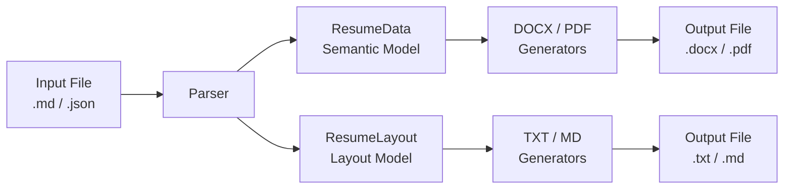
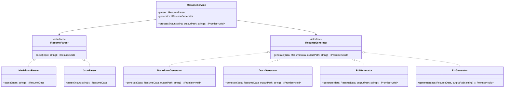
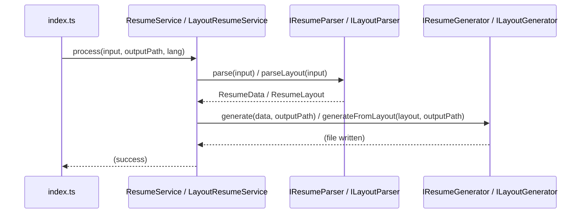
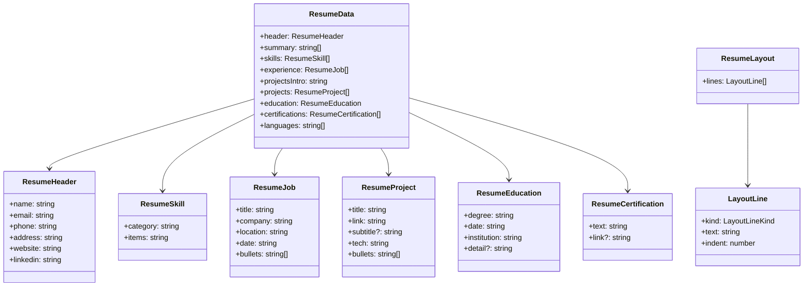

# ATS Resume Generator

A command-line tool that parses resume data from **Markdown** or **JSON** and generates formatted output in **Markdown**, **DOCX**, **PDF**, or **plain text** (TXT). Ships as a TypeScript source project and as pre-built standalone binaries — no Node.js required for end users.

---

## Quick Start (Pre-built Binaries)

No Node.js or development tools required. Download a standalone binary for your OS — it's a single file, ready to run.

### Download Latest Release

Each platform has a standalone binary and a compressed archive. Windows uses `.zip`; Linux and macOS use `.tar.gz`. SHA-256 checksums are provided for every file.

| Platform                        | Archives                                                                                                                                                                                                                                                                                                                    |
| ------------------------------- | --------------------------------------------------------------------------------------------------------------------------------------------------------------------------------------------------------------------------------------------------------------------------------------------------------------------------- |
| **Windows** (x64)               | [`ats-resume-generator-windows-x64.exe`](https://github.com/ahmadmdabit/ats-resume-generator/releases/latest/download/ats-resume-generator-windows-x64.exe) · [`ats-resume-generator-windows-x64.zip`](https://github.com/ahmadmdabit/ats-resume-generator/releases/latest/download/ats-resume-generator-windows-x64.zip)   |
| **Linux** (x64)                 | [`ats-resume-generator-linux-x64`](https://github.com/ahmadmdabit/ats-resume-generator/releases/latest/download/ats-resume-generator-linux-x64) · [`ats-resume-generator-linux-x64.tar.gz`](https://github.com/ahmadmdabit/ats-resume-generator/releases/latest/download/ats-resume-generator-linux-x64.tar.gz)             |
| **Linux** (ARM64)               | [`ats-resume-generator-linux-arm64`](https://github.com/ahmadmdabit/ats-resume-generator/releases/latest/download/ats-resume-generator-linux-arm64) · [`ats-resume-generator-linux-arm64.tar.gz`](https://github.com/ahmadmdabit/ats-resume-generator/releases/latest/download/ats-resume-generator-linux-arm64.tar.gz)     |
| **macOS** (Apple Silicon / M1+) | [`ats-resume-generator-darwin-arm64`](https://github.com/ahmadmdabit/ats-resume-generator/releases/latest/download/ats-resume-generator-darwin-arm64) · [`ats-resume-generator-darwin-arm64.tar.gz`](https://github.com/ahmadmdabit/ats-resume-generator/releases/latest/download/ats-resume-generator-darwin-arm64.tar.gz) |
| **macOS** (Intel)               | [`ats-resume-generator-darwin-x64`](https://github.com/ahmadmdabit/ats-resume-generator/releases/latest/download/ats-resume-generator-darwin-x64) · [`ats-resume-generator-darwin-x64.tar.gz`](https://github.com/ahmadmdabit/ats-resume-generator/releases/latest/download/ats-resume-generator-darwin-x64.tar.gz)         |

See the [full changelog](https://github.com/ahmadmdabit/ats-resume-generator/releases/latest) on GitHub Releases for version history and release notes.

> **💡 Tip: Use the compressed archive to avoid OS security warnings.**
> When you download a raw executable (`.exe`, or a binary with no extension), your operating system may show a security warning because the file isn't digitally signed:
>
> - **Windows SmartScreen** — "Windows protected your PC" / "Unrecognized app"
> - **macOS Gatekeeper** — "cannot be opened because the developer cannot be verified"
> - **Linux browsers** — may flag the download as potentially unsafe
>
> **The compressed archives (`.zip` / `.tar.gz`) bypass these warnings** because the OS sees them as regular archive files, not executables. Download the archive, extract it, and run the binary inside. On Windows, you may still need to right-click the `.exe` → **Properties** → check **"Unblock"** → **OK** the first time. On macOS, if you still see a warning after extracting, open **System Settings → Privacy & Security** and click **"Open Anyway"**.

PDF generation requires the `docx-to-pdf.wasm` file to be placed next to the executable. This file is bundled automatically when building with `yarn package`.

### First-time Setup

```bash
# Windows (Command Prompt)
ats-resume-generator-windows-x64.exe resume.md --format docx --name resume --lang en

# Linux / macOS (make executable first)
chmod +x ats-resume-generator-linux-x64
./ats-resume-generator-linux-x64 resume.md --format docx --name resume --lang en
```

> **Note:** Input and lang counts must match (one input per lang, no fallback). See [Usage](#usage) for multi-language examples.

---

## Overview

This project implements a **SOLID‑principled** workflow for resume generation. It separates parsing, data modeling, and output generation, allowing new input or output formats to be added without modifying existing code.

### Key Features

- **Input Formats:** Markdown (`.md`) or JSON (`.json`)
- **Output Formats:** Markdown (`.md`), DOCX (`.docx`), PDF (`.pdf`), plain text (`.txt`)
- **TypeScript** with strict typing
- **PDF generation** via `docx‑to‑pdf‑wasm` (converts DOCX to PDF using WebAssembly)
- **Dependency injection** for decoupled, testable components
- **Standalone binaries** for Windows, macOS, and Linux (via Bun `--compile`)

### High‑Level Data Flow (Workflow)


```mermaid
flowchart LR
    A[Input File<br>.md / .json] --> B[Parser]
    B --> C1[ResumeData<br>Semantic Model]
    B --> C2[ResumeLayout<br>Layout Model]
    C1 --> D1[DOCX / PDF<br>Generators]
    C2 --> D2[TXT / MD<br>Generators]
    D1 --> E[Output File<br>.docx / .pdf]
    D2 --> E2[Output File<br>.txt / .md]
```

Two processing paths: semantic (DOCX/PDF) and layout (TXT/MD). The parser produces both models; each generator consumes the one it needs.

---

## Architecture

```
src/
├── core/               # Interfaces & data models
│   ├── interfaces.ts   # IResumeParser, ILayoutParser, IResumeGenerator, ILayoutGenerator
│   └── models.ts       # ResumeData, ResumeLayout, ResumeJob, ResumeProject, etc.
├── parsers/            # Input parsers
│   ├── MarkdownParser.ts   # marked.lexer-based; implements IResumeParser + ILayoutParser
│   └── JsonParser.ts       # thin JSON.parse wrapper; synthesizes canonical layout
├── generators/         # Output generators
│   ├── MarkdownGenerator.ts  # ILayoutGenerator — renders ResumeLayout back to Markdown
│   ├── DocxGenerator.ts      # IResumeGenerator — docx library; Calibri, green theme
│   ├── PdfGenerator.ts       # delegates to DocxGenerator → docx-to-pdf-wasm
│   └── TxtGenerator.ts       # ILayoutGenerator — renders ResumeLayout as plain text
├── services/           # Orchestration
│   └── ResumeService.ts  # ResumeService (semantic) + LayoutResumeService (layout)
└── index.ts            # CLI entry — selects path by output extension
```

### SOLID Principles Applied

| Principle                 | Implementation                                                                                          |
| ------------------------- | ------------------------------------------------------------------------------------------------------- |
| **Single Responsibility** | Each parser/generator handles exactly one format                                                        |
| **Open/Closed**           | New parser/generator classes can be added without changing existing ones (CLI entry point needs update) |
| **Liskov Substitution**   | All parsers/generators are interchangeable                                                              |
| **Interface Segregation** | `IResumeParser`/`ILayoutParser` and `IResumeGenerator`/`ILayoutGenerator` are minimal and focused     |
| **Dependency Inversion**  | `ResumeService` depends on abstractions, not concretions                                                |

#### Class Diagram – SOLID Design


```mermaid
classDiagram
    class IResumeParser {
        <<interface>>
        +parse(input: string): ResumeData
    }
    class IResumeGenerator {
        <<interface>>
        +generate(data: ResumeData, outputPath: string): Promise~void~
    }
    class MarkdownParser {
        +parse(input: string): ResumeData
    }
    class JsonParser {
        +parse(input: string): ResumeData
    }
    class MarkdownGenerator {
        +generate(data: ResumeData, outputPath: string): Promise~void~
    }
    class DocxGenerator {
        +generate(data: ResumeData, outputPath: string): Promise~void~
    }
    class PdfGenerator {
        +generate(data: ResumeData, outputPath: string): Promise~void~
    }
    class TxtGenerator {
        +generate(data: ResumeData, outputPath: string): Promise~void~
    }
    class ResumeService {
        -parser: IResumeParser
        -generator: IResumeGenerator
        +process(input: string, outputPath: string): Promise~void~
    }

    IResumeParser <|.. MarkdownParser
    IResumeParser <|.. JsonParser
    IResumeGenerator <|.. MarkdownGenerator
    IResumeGenerator <|.. DocxGenerator
    IResumeGenerator <|.. PdfGenerator
    IResumeGenerator <|.. TxtGenerator
    ResumeService --> IResumeParser
    ResumeService --> IResumeGenerator
```

This class diagram clarifies the interface‑based design and dependency injection.

---

## Prerequisites (Building from Source)

- Node.js version 18+ (ES2020 modules)
- Yarn 4.17.0 (recommended — project ships with a `yarn.lock`)
- [Bun](https://bun.sh) — only required for building standalone binaries

## Installation (Building from Source)

```bash
yarn install
```

### Available Scripts

| Command                        | Description                                                              |
| ------------------------------ | ------------------------------------------------------------------------ |
| `yarn build` / `npm run build` | Compile TypeScript source to `./dist/`                                   |
| `yarn start`                   | Run `node dist/index.js` (requires build)                                |
| `yarn generate`                | Run `ts-node src/index.ts` directly (no build needed)                    |
| `yarn package`                 | Build standalone binaries for all platforms (output: `./build/Release/`) |
| `yarn package:windows`         | Build a standalone binary for Windows x64 (output: `./build/Release/`)   |

### Run (from source)

```bash
yarn generate <input.(md|json)> --format <txt,md,docx,pdf> --name <output> --lang <en|tr>
```

### Run (compiled)

```bash
yarn start <input.(md|json)> --format <txt,md,docx,pdf> --name <output> --lang <en|tr>
```

---

## Usage

```bash
ats-resume-generator <input.(md|json)> [options]

Options:
  -f, --format <list>     Output formats: txt,md,docx,pdf (comma-separated, default: txt)
  -n, --name <list>       Output file name(s) without extension (comma-separated, default: input stem)
  --lang <list>           Language(s): en,tr (comma-separated, required)
  --no-blank-lines        Remove blank paragraphs from DOCX output
  --date <yyyy-MM-dd>     Append date to output file name
  -h, --help              Show help message
```

The `--lang` argument selects the output language(s) (`en` or `tr`) and is **required**; it controls the section headings and field labels written by every generator. Multiple languages can be specified as a comma-separated list.

**Input and lang counts must match** (one input per lang, no fallback). Provide a comma-separated list of input files, one per language.

The `--name` argument specifies the output file name(s) without extension. When multiple languages are given, each language produces a file named `{name}-{LANG}.{format}` (lang uppercased). If a single name is provided for multiple languages, it is reused for all. The optional `--date` flag appends `--{yyyy-MM-dd}` before the extension.

### Examples

```bash
# Single format, single language
ats-resume-generator resume.md --format pdf --name Resume-EN --lang en

# Batch output (4 files: Resume-EN.txt, Resume-EN.md, Resume-EN.docx, Resume-EN.pdf)
ats-resume-generator resume.md --format txt,md,docx,pdf --name Resume-EN --lang en

# Multiple languages, one input per lang (2 files: Resume-en.txt, Resume-tr.txt)
ats-resume-generator en.md,tr.md --format txt --name Resume --lang en,tr

# Multiple languages, multiple names (2 files: A-en.txt, B-tr.txt)
ats-resume-generator en.md,tr.md --format txt --name A,B --lang en,tr

# Remove blank paragraphs from DOCX output
ats-resume-generator resume.md --format docx --name Resume-EN --lang en --no-blank-lines

# Show help
ats-resume-generator --help
```

---

## Sequence Diagram – Execution Flow


```mermaid
sequenceDiagram
    participant CLI as index.ts
    participant Service as ResumeService / LayoutResumeService
    participant Parser as IResumeParser / ILayoutParser
    participant Generator as IResumeGenerator / ILayoutGenerator

    CLI->>Service: process(input, outputPath, lang)
    Service->>Parser: parse(input) / parseLayout(input)
    Parser-->>Service: ResumeData / ResumeLayout
    Service->>Generator: generate(data, outputPath) / generateFromLayout(layout, outputPath)
    Generator-->>Service: (file written)
    Service-->>CLI: (success)
```

Two processing paths: semantic (DOCX/PDF) and layout (TXT/MD). `index.ts` selects the path by output extension.

---

## Input Format

### Data Model – ResumeData Structure


```mermaid
classDiagram
    class ResumeData {
        +header: ResumeHeader
        +summary: string[]
        +skills: ResumeSkill[]
        +experience: ResumeJob[]
        +projectsIntro: string
        +projects: ResumeProject[]
        +education: ResumeEducation
        +certifications: ResumeCertification[]
        +languages: string[]
    }
    class ResumeLayout {
        +lines: LayoutLine[]
    }
    class LayoutLine {
        +kind: LayoutLineKind
        +text: string
        +indent: number
    }
    class ResumeHeader {
        +name: string
        +email: string
        +phone: string
        +address: string
        +website: string
        +linkedin: string
    }
    class ResumeSkill {
        +category: string
        +items: string
    }
    class ResumeJob {
        +title: string
        +company: string
        +location: string
        +date: string
        +bullets: string[]
    }
    class ResumeProject {
        +title: string
        +link: string
        +subtitle?: string
        +tech: string
        +bullets: string[]
    }
    class ResumeEducation {
        +degree: string
        +date: string
        +institution: string
        +detail?: string
    }
    class ResumeCertification {
        +text: string
        +link?: string
    }

    ResumeData --> ResumeHeader
    ResumeData --> ResumeSkill
    ResumeData --> ResumeJob
    ResumeData --> ResumeProject
    ResumeData --> ResumeEducation
    ResumeData --> ResumeCertification
    ResumeLayout --> LayoutLine
```

This diagram gives a quick visual reference of the data structure used throughout the system.

### Markdown Structure

The Markdown parser expects sections with the following headings (case‑sensitive):

```
# John Doe
E-mail: john@example.com
Phone: +1 234 567 890
Address: 123 Main St, City, Country
Website: https://john.dev

## PROFESSIONAL SUMMARY
[paragraph text]

## TECHNICAL SKILLS
- Category: item1, item2, item3

## PROFESSIONAL EXPERIENCE
Senior Developer - Company Inc., Location
01/2020 – Present
- Bullet point 1
- Bullet point 2

## PROJECTS
[Complete portfolio](https://github.com/john/portfolio)

[Project Title](https://project.link)
Technologies: TypeScript, Node.js
- Bullet point

## EDUCATION
B.Sc. in Computer Science
09/2016 – 06/2020
- University Name

## CERTIFICATIONS
- Certification Name - [Reference](https://cert.link)

## LANGUAGES
- English (Native)
- Spanish (Fluent)
```

### JSON Structure

The JSON schema mirrors the `ResumeData` interface:

```json
{
  "header": {
    "name": "John Doe",
    "email": "john@example.com",
    "phone": "+1 234 567 890",
    "address": "123 Main St, City, Country",
    "website": "https://john.dev"
  },
  "summary": ["Paragraph text"],
  "skills": [{ "category": "Programming", "items": "TypeScript, Node.js, Python" }],
  "experience": [
    {
      "title": "Senior Developer",
      "company": "Company Inc.",
      "location": "Remote",
      "date": "01/2020 – Present",
      "bullets": ["Bullet point 1", "Bullet point 2"]
    }
  ],
  "projectsIntro": "[Complete portfolio](https://github.com/john/portfolio)",
  "projects": [
    {
      "title": "Project Title",
      "link": "https://project.link",
      "subtitle": "Optional subtitle",
      "tech": "TypeScript, Node.js",
      "bullets": ["Bullet point"]
    }
  ],
  "education": {
    "degree": "B.Sc. in Computer Science",
    "date": "09/2016 – 06/2020",
    "institution": "University Name"
  },
  "certifications": [{ "text": "Certification Name", "link": "https://cert.link" }],
  "languages": ["English (Native)", "Spanish (Fluent)"]
}
```

---

## Output Format Details

| Format       | Implementation Notes                                                                                       |
| ------------ | ---------------------------------------------------------------------------------------------------------- |
| **Markdown** | ILayoutGenerator — renders ResumeLayout back to Markdown (exact round-trip)                                |
| **DOCX**     | IResumeGenerator — uses `docx` library with custom styles (Calibri, green accents, shaded headings)        |
| **PDF**      | Generated via DOCX → PDF conversion using `docx‑to‑pdf‑wasm`; creates and removes a temporary `.docx` file |
| **TXT**      | ILayoutGenerator — renders ResumeLayout as plain text (strips Markdown syntax, uppercases H2 headings)     |

---

## Technical Constraints

- **PDF Generation:** Requires a WebAssembly module from `docx‑to‑pdf‑wasm`. The module is compiled and cached after first use. In standalone binaries, `docx-to-pdf.wasm` must be placed next to the executable.
- **Memory:** Temporary DOCX files use a unique per-run name in the same directory as the output PDF and are deleted after conversion, so they never collide with a user-generated `.docx`.
- **Node.js Version:** ES2020 modules; requires Node.js 18+.
- **Package Manager:** Yarn 4.17.0 (see `.yarnrc.yml`).
- **Bun:** Required only on the build machine for standalone binary generation.

---

## Continuous Integration & Delivery

This repository uses GitHub Actions for automated builds and releases:

### CI Workflow (`.github/workflows/ci.yml`)

- Triggered on pushes to `main`/`master` and pull requests
- Uses Node.js 22 and Yarn 4 via Corepack
- Caches Yarn dependencies for faster runs
- Runs TypeScript compilation and type checking (`yarn build`)

### Release Workflow (`.github/workflows/release.yml`)

- Triggered after a successful CI run on push events (e.g., tagged commits)
- Builds TypeScript and packages standalone binaries for all 5 supported platforms via `yarn package` (Bun `--compile` cross-compilation)
- Copies the `docx-to-pdf.wasm` asset into the output directory alongside each binary (required for PDF generation)
- Generates compressed archives (`.tar.gz` / `.zip`) and SHA‑256 checksums
- Creates a GitHub Release with the packaged assets and an auto‑generated changelog

---

## Dependencies

| Package                   | Version | Purpose                              |
| ------------------------- | ------- | ------------------------------------ |
| `docx`                    | 9.7.1   | DOCX document creation               |
| `docx‑to‑pdf‑wasm`        | ^0.1.0  | DOCX → PDF conversion via WASM       |
| `marked`                  | 18.0.5  | Markdown lexing for parsing          |
| `promisify-child-process` | ^5.0.1  | Cross-platform child process wrapper |
| `typescript`              | ^5.9.3  | Development compiler                 |
| `ts‑node`                 | ^10.9.2 | Run TypeScript directly              |

---

## Extending the System

### Adding a New Input Parser

1. Implement `IResumeParser` (semantic model) and optionally `ILayoutParser` (layout model):
   ```ts
   export class MyParser implements IResumeParser, ILayoutParser {
     parse(input: string): ResumeData { /* ... */ }
     parseLayout(input: string): ResumeLayout { /* ... */ }
   }
   ```
2. Add a new condition in `src/index.ts` for your file extension.

### Adding a New Output Generator

1. Implement `IResumeGenerator` (consumes `ResumeData`, for DOCX/PDF) or `ILayoutGenerator` (consumes `ResumeLayout`, for TXT/MD):
   ```ts
   export class MyGenerator implements IResumeGenerator {
     async generate(data: ResumeData, outputPath: string, lang: LANG, options?: GeneratorOptions): Promise<void> {
       /* ... */
     }
   }
   ```
2. Add a new condition in `src/index.ts` for your output extension.

---

## Building Standalone Binaries

Requires [Bun](https://bun.sh) on the build machine. End users do not need Node.js installed.

```bash
# Build for all platforms
node scripts/package.js --all

# Build for specific platforms
node scripts/package.js --windows-x64 --linux-x64 --darwin-arm64

# Build only native to current OS
node scripts/package.js --native
```

The `package` and `package:windows` npm scripts output to `./build/Release/`. Use `--outdir <path>` to override.

The WASM file for PDF generation (`docx-to-pdf.wasm`) is automatically copied into the output directory alongside each binary.

## Known Limitations

- PDF output depends on a third‑party WASM module; conversion may fail for very complex DOCX layouts.
- The Markdown parser is opinionated about section heading text and order.
- Hyperlinks in DOCX are styled with a specific green color (`#4EA72E`) and no underline.
- Standalone binaries built on Windows cannot cross-compile for Linux/macOS reliably (known Bun limitation); build those targets natively or via CI.
- The `docx-to-pdf.wasm` file must accompany the standalone binary for PDF generation to work.

---

## License

[MIT](LICENSE) © 2026 Ahmet Fatihoğlu
